<div align="center">

<!-- Terminal-style rect banner, matched to the skull art's matrix green -->





<br/><br/>

<!-- Original skull/hello ASCII-art render, dropped straight in for pixel-perfect match -->


</div>

<br/>

<div align="center">

### `> cat about_me.txt`

</div>

```yaml
name: Shruthi Kalyani
role: High School Student
location: Chennai, India
status: "manifesting my Tony Stark era 🦾"
current_focus: [learning to code, building cool things, world domination-ish]
fun_fact: "I read READMEs before I read the docs"
```

<div align="center">

### `> ls -la ./skills`


<br/><br/>

### `> connect --socials`

<a href="https://instagram.com/shruthikalyani"></a>
<a href="https://instagram.com/__.__kalys__.__"></a>

<br/><br/>


</div>
<!--
**shruthikalyani/shruthikalyani** is a ✨ _special_ ✨ repository because its `README.md` (this file) appears on your GitHub profile.


